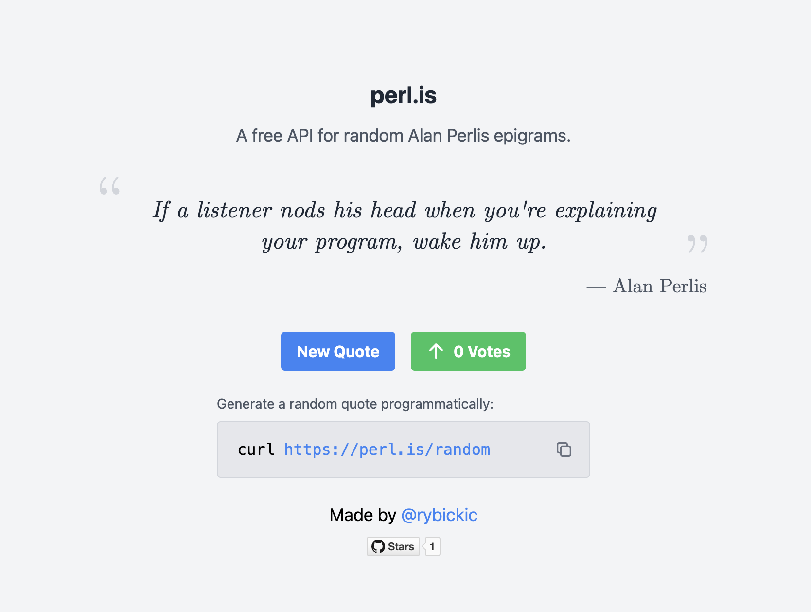

[](https://perl.is)

[](https://uptime.betterstack.com/?utm_source=status_badge)

A single serving website that provides random epigrams from Alan Perlis, built for fun.

Whenever I see one of these quotes, I tend to be impressed by how relevant a lot of them still seem, and how insane of a Twitter poster he'd probably have been if he was still around today.

Hosted with [Fly.io](https://fly.io/), using [Redis](https://redis.io/) for vote tracking and [reCAPTCHA](https://www.google.com/recaptcha/about/) for preventing abuse.

## Development

To test the entire application locally, run:

```
docker-compose up --build
```

Navigate to `localhost:8080` to see the application, and `localhost:8080/random` to get a random quote.

To stop the containers, run:

```
docker-compose down
```

----

For local development of the frontend against the live backend, set the `REACT_APP_API_URL` environment variable to `https://perl.is` and run `npm start` from the `frontend` directory:

```
REACT_APP_API_URL=https://perl.is npm start
```

Whenever you make changes to your TypeScript code, the browser will automatically refresh.

----

For local development of the backend, you can run the Go server directly with `go run main.go`. But you must first ensure:

1. The frontend has been built (`cd frontend && npm run build`)
2. You have an instance of Redis running locally. For example, you can run one with Docker: `docker run --name perlis-redis -d redis`
3. The `REDIS_URL` environment variable is set to `redis://localhost:6379`.
4. The `RECAPTCHA_DISABLED` environment variable is set to `true` to disable reCAPTCHA.

(If you do want to use reCAPTCHA, you must set the `RECAPTCHA_PROJECT_ID` and `RECAPTCHA_KEY` environment variables to your Google Cloud Project ID and reCAPTCHA site key, respectively. You'll also need to authenticate locally with the gcloud CLI).

For hot reloading, you can use [air](https://github.com/air-verse/air) to automatically restart the server when you make changes:

```
air -build.exclude_dir "frontend/node_modules"
```

----

Other helpful commands:

* `cd frontend && npm run build` - build the frontend
* `cd frontend && npm run start` - run the frontend locally
* `fly deploy` - deploy to Fly.io
* `fly secrets`, `fly certs`, `fly redis` - manage Fly.io resources for this app
